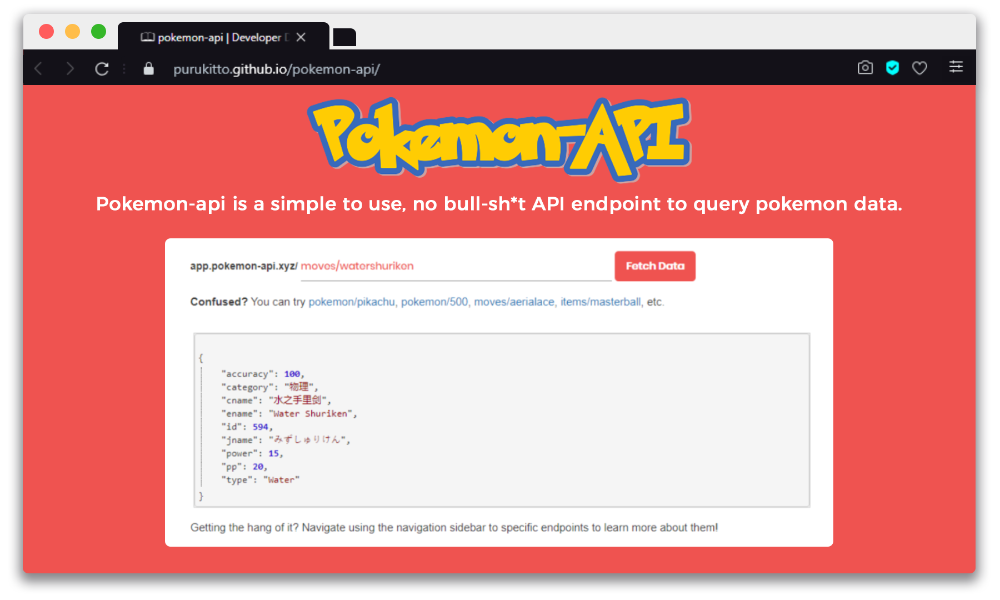

# pokemon-api

<!--

  

-->

  

Pokemon-api is a simple to use, no bull-sh*t API endpoint to query data available in [pokedex-data.json](https://github.com/Purukitto/pokemon-data.json)  
It can be currently queried at https://app.pokemon-api.xyz

## Usage
Please visit the [Wiki](https://purukitto.github.io/pokemon-api/) for more information

## Why?
There are hundred's of pokemon APIs already, with 20,000 ways to use and god knows how much incomprehensible data. This projects aim is to be as simple and straightforward to use as possible. Simple enough to be used, forked, edited and self-hosted as per personal preferences.

<!-- if link  changes update on https://github.com/tobiasbueschel/awesome-pokemon -->

### `Active Development Goals`
- [X] POST queries
- [X] Change host and move to custom DNS (v1)
- [X] Wiki
  - [ ] **[WIP]** Add Usage Examples
- [ ] Implement basic rate limits (For DDoS protection)
- [ ] FrontEnd Panel
- [ ] Develop interactions with the different queries
- [ ] Update [database](https://github.com/Purukitto/pokemon-data.json) to include Gen 8 (Looking for contributors)

## Contributing
### How to Contribute?
* Make sure that your changes do not conflict with the core files (changing file directories will require a change in all called paths)
* Follow the original code structure
* Refactoring contributions are welcome, explicitly mention "[Refactor]" in your pull request
* Give a few days to review PRs, code reviews are welcome 

## License

[GNU GPLv3](https://github.com/Purukitto/pokemon-api/blob/master/LICENSE) © Pulkit Sambhavi Singh (https://github.com/Purukitto/)

#### This project was made for educational purposes, do consider supporting development by contributing or donating if you like the project

#### Pokémon and Pokémon character names are trademarks of Nintendo and The Pokémon Company.
